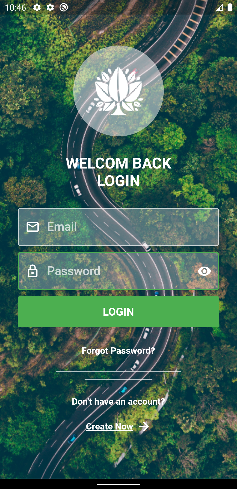
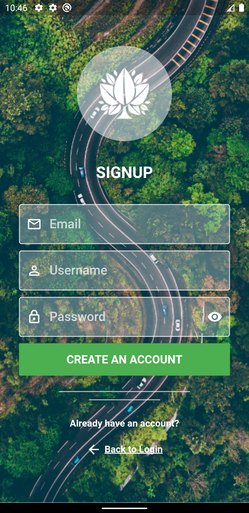

# login_ui

A basic flutter ui application. Inspiration from UpLabs

## 📸 Screenshots

| First Screen| Second Screen|
|------|-------|
|||

Feel free to make any changes or updates

## ✨ Requirements
* Any Operating System (ie. MacOS X, Linux, Windows)
* Any IDE installed that supports the Flutter SDK (ie. IntelliJ, Android Studio, Vscode etc)
* A little knowledge of Dart and Flutter
* A brain to think 🤓🤓

## 🤓 Author(s)
**Evidence Rex Osikhena**

## Getting Started

This project is a starting point for a Flutter application.

A few resources to get you started if this is your first Flutter project:

- [Lab: Write your first Flutter app](https://flutter.dev/docs/get-started/codelab)
- [Cookbook: Useful Flutter samples](https://flutter.dev/docs/cookbook)

For help getting started with Flutter, view our
[online documentation](https://flutter.dev/docs), which offers tutorials,
samples, guidance on mobile development, and a full API reference.

## LICENCE
[WTFPL](http://www.wtfpl.net/about/)
